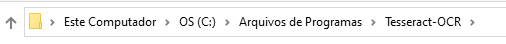

# PASSO A PASSO PARA RODAR O PROJETO

- Certifique-se de ter o Python instalado em sua máquina

- Intalar o pytesseract em sua máquina usando o link abaixo para donwload:
```
https://sourceforge.net/projects/tesseract-ocr.mirror/
```
- Executar os seguintes comandos no terminal dentro do diretorio do projeto:
```
pip install pytesseract
```
- Entrar no caminho a seguir dentro de sua máquina:

- Copiar o Path, ir na classe config.py e alterar o valor da variavel **tesseract_cmd**

- Escolher uma das imagens de dentro da Pasta Data e mudar o valor da variavel **imagem** dentro de config.py para que o
script saiba qual dos captchas ele deve tentar extrair o conteudo.
- Caso queira testar uma nova imagem, baixe apenas o Captcha atraves, insira a imagem dentro da pasta Data e altere o valor
 da variavel.

# Observações Importantes

- Este projeto tem fins educativos, não me responsabilizo por uso mal intencionado.
- Dentro da pasta Data, temos Quatro imagem com diferentes captchas. Alguns funcionam outros não. Para isso foi implementado
um sistema de Tentativas, desta forma podemos saber em quantas tentavias o script conseguiu quebrar o captcha ou quantas 
falhas teve o mesmo.

# Releases
- Para fins de organização, caso queira alterar algo crie uma branch a partir da ramificação MAIN e faça suas alterações,
após a conclusão abra um Pull Request para validarmos e realizarmos o Merge.
- Caso tenha alguma nova ideia, crie uma **ISSUE** no github:
```
https://github.com/cunhaDev/break_captcha/issues
```
